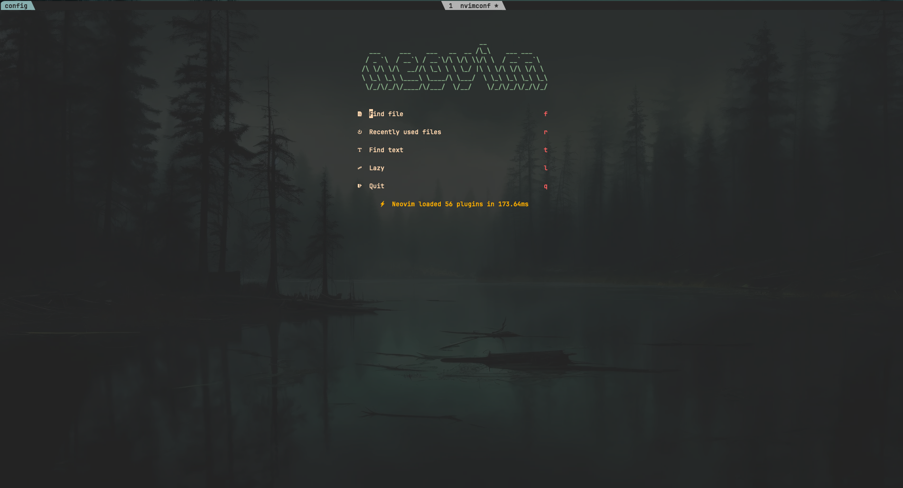
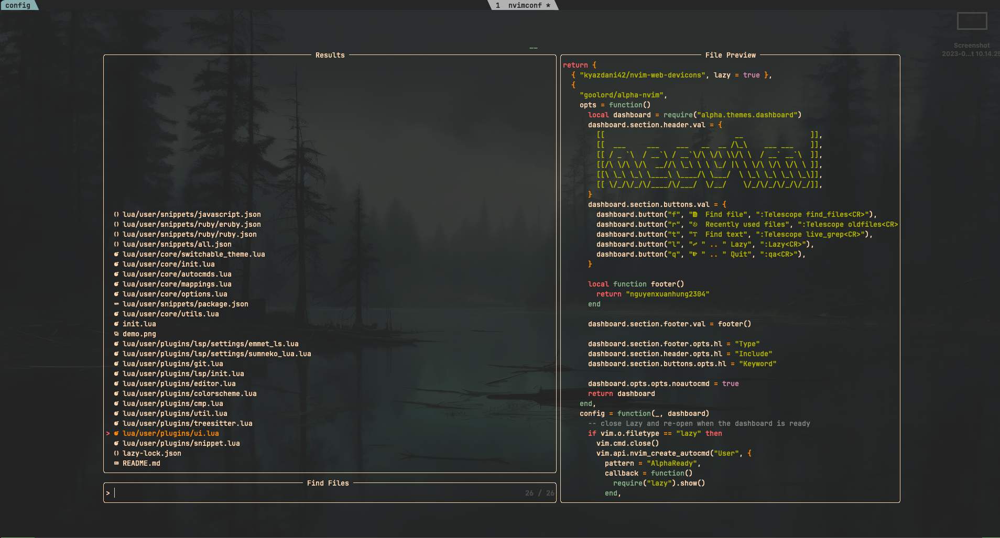
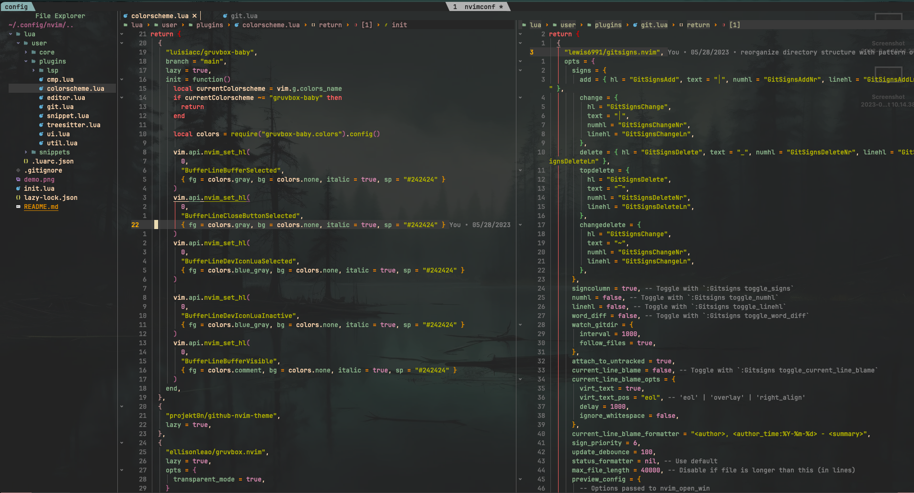
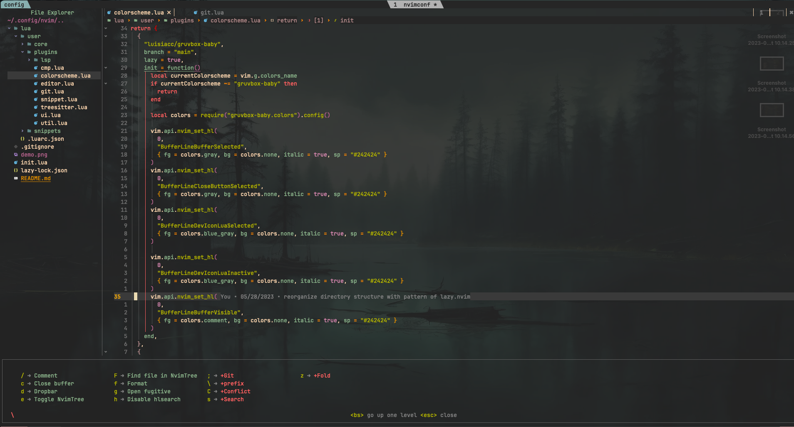

    
    
    
    

My Neovim setup powered by 💤 lazy.nvim to make it easy to customize and extend your config. Rather than having to choose between starting from scratch or using a pre-made distro

## ✨ Features

- 🔥 Transform your Neovim into a full-fledged IDE
- 💤 Easily customize and extend your config with [lazy.nvim](https://github.com/folke/lazy.nvim)
- 🚀 Blazingly fast
- 🧹 Sane default settings for options, autocmds, and keymaps
- 📦 Comes with a wealth of plugins pre-configured and ready to use

## ⚡️ Requirements

### 🚀 Need have:
- Neovim >= **0.10** (needs to be built with **LuaJIT**)
- Git >= **2.19.0** (for partial clones support)
- a [Nerd Font](https://www.nerdfonts.com/) **_(optional)_**

### 🔥 Lsp
- sourcekit: `sourcekit`
- solargraph: `gem install --user-install solargraph`
- tsserver: `npm install -g typescript typescript-language-server`
- eslint: `npm i -g vscode-langservers-extracted`
- jsonls: `npm i -g vscode-langservers-extracted`
- emmet_ls: `npm install -g emmet-ls`
- vuels: `npm install -g vls`
- lua_ls: `brew install lua-language-server`
- tailwindcss: `npm install -g @tailwindcss/language-server`
 
### 🧹 Formatters
- rubocop: `gem install rubocop`
- swiftformat: `brew install swiftformat`
- prettier: `npm install --save-dev --save-exact prettier`
- styluad: `brew install stylua`
- html, css, eslint: `npm i -g vscode-langservers-extracted`

## 📂 File Structure

The files under config will be automatically loaded at the appropriate time,
so you don't need to require those files manually.

You can add your custom plugin specs under `lua/plugins/`. All files there
will be automatically loaded by [lazy.nvim](https://github.com/folke/lazy.nvim)

<pre>
~/.config/nvim
├── lua
│   ├── config
│   │   ├── autocmds.lua
│   │   ├── mappings.lua
│   │   ├── init.lua
│   │   └── options.lua
│   └── plugins
│       ├── spec1.lua
│       ├── **
│       └── spec2.lua
└── init.lua
</pre>
